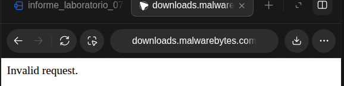
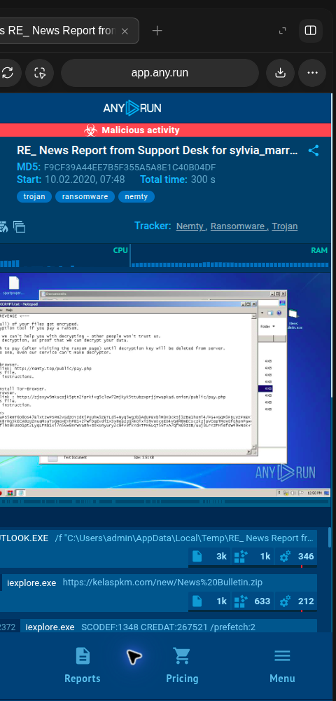
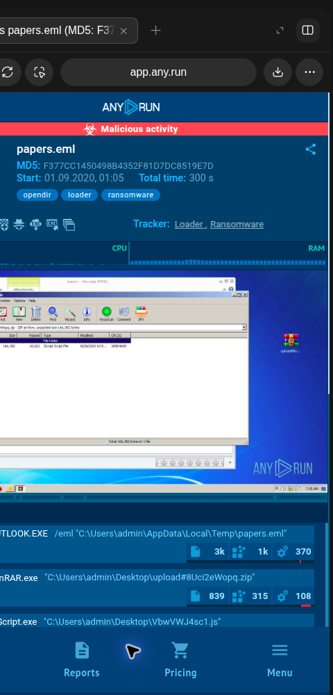
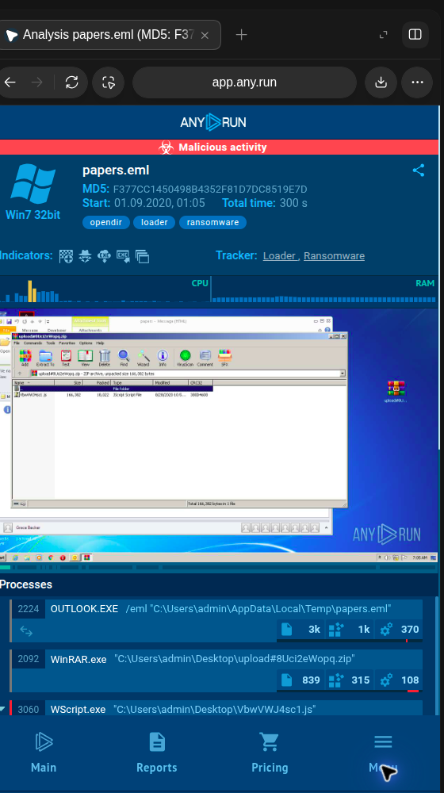

# Guía Práctica de Laboratorio N.° 07
## Análisis de Malware

**Curso:** Seguridad de Tecnologías de Información  
**Estudiante:** Carlos Daniel Ayala Ramos  
**Docente:** Dr. Renzo Alberto Taco Coayla  
**Tacna – Perú, 2026**

[[PAGEBREAK]]

# Índice General

Introducción ........................................................................................................ 3  
1. Información sobre el evento práctico ............................................................ 3  
2. Procedimiento o metodología ............................................................................ 5  
3. Resultados ........................................................................................................ 11  
4. Conclusiones ..................................................................................................... 12  
5. Cuestionario ...................................................................................................... 13  
6. Referencias bibliográficas ................................................................................ 14  
7. Anexos .............................................................................................................. 15  

[[PAGEBREAK]]

# Introducción

El análisis de malware permite describir archivos y comportamientos que pueden comprometer la confidencialidad, integridad o disponibilidad de los sistemas. Su práctica combina técnicas estáticas, que examinan propiedades y contenido sin ejecutar el objeto, y técnicas dinámicas, que observan la actividad dentro de un entorno controlado. El uso de hashes, metadatos, reglas YARA, motores antimalware y sandboxes facilita la clasificación y correlación de evidencias; sin embargo, cada resultado depende de la cobertura de la herramienta, la muestra y el contexto. Por ello, una coincidencia, una ausencia de detección o un hash calculado no bastan por sí solos para declarar un archivo malicioso o seguro.

El presente laboratorio documenta las actividades ejecutadas en el equipo disponible y sus límites. Se revisaron dos informes públicos de ANY.RUN y se analizaron cinco archivos demostrativos benignos para identificar formatos, extraer metadatos, calcular MD5, SHA-256 y ssdeep, consultar VirusTotal por hash y validar reglas YARA. El flujo estático se repitió dentro de la imagen oficial de REMnux para contenedores, con las muestras montadas en solo lectura y sin red. Ninguna muestra se ejecutó ni se cargó a servicios externos. Para Malwarebytes se descargó el instalador oficial y se preparó una VM Windows aislada en Docker; la instalación y el escaneo quedaron pendientes de autorización expresa para aceptar sus términos de licencia.

# 1. Información sobre el evento práctico

## 1.1 Título del evento práctico

Guía de Laboratorio N.° 07: Análisis de Malware.

## 1.2 Objetivos

**Objetivo general.** Aplicar procedimientos estáticos y de observación controlada para caracterizar archivos, generar evidencias reproducibles y explicar sus límites en un laboratorio de análisis de malware.

**Objetivos específicos.**

- Diagnosticar el sistema anfitrión y documentar la disponibilidad de herramientas y plataformas de análisis.
- Examinar dos informes públicos de ransomware en ANY.RUN, identificando procesos, archivos, etiquetas e indicadores de red publicados.
- Preparar cinco muestras benignas de formatos distintos y obtener su tipo, metadatos y huellas MD5, SHA-256 y ssdeep.
- Contrastar la consistencia de las huellas criptográficas mediante hashlib de Python y consultar VirusTotal por SHA-256 sin cargar archivos.
- Compilar y aplicar reglas YARA didácticas, correlacionando sus coincidencias con los demás resultados sin interpretarlas como veredictos de malware.

## 1.3 Tiempo de duración

La guía establece una duración prevista de 2 horas. La ejecución y documentación se desarrollaron el 8 de octubre de 2026; el tiempo efectivo de esta automatización no se cronometró.

## 1.4 Resultados de aprendizaje

Se consolidó la capacidad de distinguir análisis estático de dinámico, registrar evidencias verificables, interpretar hashes y resultados de reputación con cautela, y documentar las restricciones del entorno. La revisión de informes sandbox permitió relacionar etapas de ejecución sin ejecutar código malicioso localmente.

## 1.5 Recursos utilizados

| Recurso | Uso y estado |
|---|---|
| Ubuntu 24.04.5 LTS, x86-64 | Sistema anfitrión; análisis estático local |
| file, md5sum, sha256sum, Python hashlib | Identificación y verificación de huellas |
| ExifTool 12.76 local / 13.59 en REMnux y ssdeep 2.14.1 | Metadatos y hash difuso; herramientas locales y del contenedor |
| YARA y yarac 4.5.0 | Validación sintáctica y aplicación de reglas didácticas; repetición en REMnux |
| VirusTotal API v3 | Cinco consultas GET por SHA-256; sin cargas de archivos |
| ANY.RUN | Consulta de dos reportes públicos ya publicados |
| Docker Engine 29.8.1 y REMnux `noble` | La imagen oficial se ejecutó sin red; muestras y regla montadas en solo lectura; imagen retirada al terminar para liberar espacio |
| VirtualBox 7.0.20 | Presente; módulo de kernel no disponible y sin máquinas registradas |
| Malwarebytes para Windows | Instalador oficial descargado; VM temporal preparada, pero no iniciada ni instalada mientras se espera autorización de licencia |
| FileASSASSIN | No se ejecutó; enlace oficial histórico devuelve “Invalid request” y la página actual redirige a descargas generales |
| Cinco archivos benignos locales | Muestras creadas con fines reproducibles y no ejecutadas |

Las herramientas auxiliares locales se mantuvieron dentro de 08_herramientas mediante paquetes Ubuntu descargados y extraídos en el directorio del laboratorio. Además, se ejecutó la imagen completa `remnux/remnux-distro:noble`; Docker reportó 18,796,300,564 bytes. El volumen disponible se comprobó antes y después: la descarga temporal se eliminó tras guardar las salidas y el digest, con lo que se liberó de nuevo el espacio de caché. La preparación de Windows almacena su disco potencial dentro de `02_malwarebytes/windows_storage`; esa carpeta permanece vacía mientras la VM no se inicie. La guía de REMnux describe tanto la imagen completa como contenedores de herramientas individuales (REMnux, s. f.-a, s. f.-b).

## 1.6 Seguridad y alcance

La actividad se limitó a archivos benignos generados localmente, consultas por identificador criptográfico y consulta de informes públicos. No se descargó ni ejecutó malware, no se inició tráfico hacia infraestructura de comando y control y no se cargó ningún archivo a VirusTotal. La API se utilizó con cinco solicitudes, espaciadas por al menos 26 segundos; se respetaron tanto el límite indicado por el usuario como la política conservadora del prompt maestro. La clave no se almacenó en el código ni se incluyó en los artefactos.

# 2. Procedimiento o metodología

## 2.1 Diagnóstico del entorno

En el diagnóstico inicial se identificó Ubuntu 24.04.5 LTS con arquitectura x86-64 y kernel Linux 7.0.0-34-generic. El procesador se reconoció como Intel Core i5-1155G7 con ocho CPU lógicas. El sistema informó aproximadamente 11 GiB de memoria y 42 GB libres en el volumen de trabajo. systemd-detect-virt no identificó una máquina virtual. Docker Engine se encontraba activo; VirtualBox estaba instalado, pero no se registraron máquinas virtuales y el módulo vboxdrv no estaba cargado. En ese momento no se encontraron Malwarebytes, una distribución REMnux ni un contenedor REMnux accesible; la imagen se descargó posteriormente para ejecutar el flujo estático. El resultado detallado se conserva en 01_diagnostico/diagnostico_entorno.txt y .json.

## 2.2 Malwarebytes, análisis antimalware y FileASSASSIN

El anfitrión ejecuta Ubuntu y la versión actual de Malwarebytes para escritorio no ofrece una edición Linux. Se descargó desde el enlace oficial el instalador `MBSetup.exe` (2,906,704 bytes; SHA-256 registrado en `MBSetup.sha256`) y se preparó, sin iniciar, una VM Windows 11 en Docker. El lanzador limita la interfaz a `127.0.0.1:8006`, guarda el disco virtual dentro de la carpeta del laboratorio y publica el instalador y las cinco muestras mediante un recurso de solo lectura. La imagen de Windows quedó descargada, pero la VM no se inició ni se aceptaron licencias mientras se espera autorización expresa para aceptar los términos de Windows y Malwarebytes. En consecuencia, no se atribuyen resultados de instalación, actualización, escaneo, cuarentena o detección. La descarga del instalador no implica que Malwarebytes se haya ejecutado.

El centro de ayuda actual documenta la instalación en Windows y los análisis personalizados; el fabricante distingue las funciones gratuitas de las suscritas. FileASSASSIN se verificó mediante su antigua ruta oficial de descarga, que respondió “Invalid request”, y la página de producto condujo a la descarga general. La información histórica de Malwarebytes describe FileASSASSIN como utilidad para eliminar archivos bloqueados, pero no acredita la disponibilidad de un instalador vigente. No se usaron copias de terceros ni se intentó eliminar archivos. Por tanto, la herramienta se registra como retirada o no disponible para reproducirla en esta versión (Malwarebytes Help Center, s. f.-a, s. f.-b, s. f.-c, s. f.-d; Malwarebytes, 2017).

**Figura 4. Verificación de disponibilidad del enlace oficial de FileASSASSIN.** La captura de la pestaña del navegador muestra el dominio del sitio de descargas de Malwarebytes y la respuesta textual “Invalid request”. La navegación se realizó el 8 de octubre de 2026, sin descargar ejecutables ni seguir enlaces de terceros. La observación confirma que la ubicación histórica no entrega actualmente el instalador en esta sesión; por sí sola no determina el estado de versiones previamente obtenidas ni la existencia de copias archivadas. La página de producto también redirigió a descargas generales y el centro de ayuda actual no aportó un instalador vigente. Por ello se documentó la función histórica con una referencia del fabricante y se dejó su uso sin reproducir. La figura representa una consulta de disponibilidad, no el uso de FileASSASSIN ni la eliminación de un archivo.

## 2.3 Observación de informes públicos en ANY.RUN

Se revisaron dos informes públicos vinculados en el material académico. El primero registra un caso rotulado como troyano, ransomware y Nemty, con el asunto “RE_ News Report from Support Desk”, MD5 F9CF39A44EE7B5F355A5A8E1C40B04DF y una sesión de 300 segundos. El árbol observado relaciona Outlook, Internet Explorer, la descarga de News Bulletin.zip desde kelaspkm.com, WinRAR y News Bulletin.exe; el reporte también muestra comandos orientados a modificar el almacenamiento de copias sombra y cerrar procesos. La captura corresponde al reporte público consultado, no a una ejecución realizada en el equipo del laboratorio.

**Figura 1. Reporte público de ANY.RUN: caso Nemty.**  
La captura muestra el encabezado del reporte asociado al mensaje de soporte, su MD5, la duración de la sesión y las etiquetas de amenaza publicadas por ANY.RUN. En el escritorio virtual del análisis se observa una nota de rescate, mientras que la lista de actividad comienza a mostrar procesos de Outlook e Internet Explorer y la referencia a la descarga de un archivo ZIP desde el dominio kelaspkm.com. El conjunto es consistente con una cadena de entrega por correo y posterior ejecución del contenido comprimido, aunque la imagen por sí sola no permite reconstruir todos los pasos ni demostrar el alcance de la infección. La interpretación se complementó con el árbol de procesos del reporte consultado. La evidencia documenta una fuente pública de sandbox y no una prueba local con ransomware (ANY.RUN, 2020a).

El reporte público “papers.eml” (MD5 F377CC1450498B4352F81D7DC8519E7D) registra una sesión de 300 segundos y las etiquetas opendir, loader y ransomware. La cadena observada pasa de Outlook y WinRAR a WScript.exe con un script JavaScript; posteriormente aparecen 582538.dat y mshta.exe con info.hta. La actividad de red publica una solicitud GET asociada con sunleafvacations.com. Estos hechos corresponden a la sandbox remota y no se reprodujeron localmente.

**Figura 2. Resumen del reporte público “papers.eml” en ANY.RUN.**  
La evidencia conserva la página pública del análisis, el identificador MD5, la ventana temporal de 300 segundos y las etiquetas asignadas al caso. En la máquina Windows 7 de la sandbox se aprecia un mensaje de correo y una ventana de WinRAR que expone el archivo contenido en el paquete. En la zona inferior aparecen las primeras entradas del árbol de procesos, que vinculan Outlook con WinRAR y un script ejecutado por Windows Script Host. La vista permite ubicar la transición desde el adjunto hacia los componentes extraídos, pero no presenta por sí sola todos los eventos posteriores ni acredita que la actividad continúe vigente. La lectura detallada del árbol y de la actividad publicada complementó esta captura; ambos resultados corresponden al reporte remoto y no a una ejecución local (ANY.RUN, 2020b).

**Figura 3. Procesos observados en el reporte “papers.eml”.**  
La captura corresponde a la vista desplazada del mismo análisis y muestra entradas del árbol que siguen a la apertura del correo: el proceso de WinRAR, la invocación de WScript.exe con el archivo JavaScript y actividad posterior asociada al contenido descargado. El reporte registra además una carga con extensión .dat y la apertura de un archivo HTA por mshta.exe, patrón que resulta relevante para investigar cadenas de descarga y ejecución indirecta. La observación del árbol facilita relacionar padre e hijo y formular hipótesis sobre el flujo de infección, pero la imagen disponible recorta parte del panel lateral y no sustituye el registro completo del servicio. Los nombres y eventos se interpretan como datos del informe público de ANY.RUN, no como procesos presentes en el equipo analizado (ANY.RUN, 2020b).

## 2.4 Preparación de las cinco muestras

Al no existir cinco archivos benignos de laboratorio suministrados, se generaron localmente cinco muestras demostrativas: texto TXT, documento JSON, registros CSV, archivo ZIP con un LEEME.txt benigno y un archivo .py de texto inerte. Cada muestra se identificó como generada para la práctica; no se descargó de repositorios y no se ejecutó. Los originales quedaron en `04_remnux/muestras`; para el escaneo estático REMnux se montaron en el contenedor como solo lectura. Se preparó una copia de trabajo adicional para Malwarebytes, también publicada a Windows mediante un recurso de solo lectura, pero la VM todavía no se inició.

## 2.5 Identificación del tipo y extracción de metadatos

Se aplicaron `file` y ExifTool a cada archivo dentro de REMnux. El tipo reconocido fue coherente con el formato previsto: ASCII, JSON, CSV, ZIP y texto UTF-8, respectivamente. ExifTool recogió metadatos disponibles; por el tamaño y la naturaleza de las muestras generadas, la información específica fue limitada. Las salidas completas se guardaron en `04_remnux/metadatos` y `04_remnux/resultados_docker/ejecucion_remnux.log`; los tipos MIME se incorporaron a la tabla consolidada. La extensión se consideró una etiqueta y no prueba suficiente del contenido real.

## 2.6 Cálculo y comprobación de hashes

Para cada archivo se ejecutaron `md5sum`, `sha256sum` y `ssdeep` dentro de REMnux. Los valores MD5 de 32 caracteres hexadecimales y SHA-256 de 64 caracteres hexadecimales se contrastaron con una segunda implementación mediante `hashlib` de Python; los cinco pares coincidieron. No se contó con un hash de referencia confiable de origen externo, por lo que el resultado demuestra consistencia de cálculo, pero no autenticidad ni integridad respecto de una versión previa. REMnux volvió a producir los mismos MD5 y SHA-256. ssdeep generó huellas, aunque advirtió que varios archivos eran demasiado pequeños para producir valores comparativos significativos; por ello se preservaron como salida técnica y no se usan para inferir similitud. MD5 se conservó como identificador comparativo y no como mecanismo suficiente de autenticación.

## 2.7 Consulta de VirusTotal por SHA-256

Se consultó el endpoint GET /api/v3/files/{id} empleando exclusivamente el SHA-256 de cada muestra. La operación siguió la documentación de VirusTotal para consultar un reporte por hash y no para subir el archivo (VirusTotal, s. f.). Se realizaron cinco solicitudes únicas, una por muestra, con intervalos mínimos de 26 segundos. Las cinco respuestas fueron HTTP 404 NotFoundError; por tanto, el servicio no proporcionó reportes para esos hashes. No se registraron conteos de motores ni fechas de análisis donde no había un objeto de archivo. “Sin reporte” no se interpretó como “limpio” o “seguro”. El JSON íntegro y sin secretos se conserva en resultados_virustotal.json.

## 2.8 Validación YARA

Se redactaron dos reglas didácticas en `05_yara/reglas/reglas_laboratorio.yar` y se comprobó su sintaxis con `yarac` 4.5.0. Las reglas identifican cadenas insertadas deliberadamente en la muestra TXT y en la muestra JSON. La ejecución sobre los cinco archivos en REMnux produjo dos coincidencias controladas: `Cadena_Controlada_Muestra` en M01 y `Marcador_JSON_Benigno` en M02; M03, M04 y M05 no coincidieron. Este resultado ilustra el funcionamiento de patrones concretos, no una clasificación de malware. La interpretación depende de cada cadena y su contexto (YARA, s. f.).

## 2.9 Correlación de evidencias

Los resultados se relacionaron por identificador M01–M05 en el CSV consolidado. En las cinco muestras, los hashes obtenidos en Ubuntu coincidieron con los calculados de nuevo en REMnux; VirusTotal no devolvió informes y las dos coincidencias YARA se explican por marcadores añadidos a propósito. Las muestras se montaron en REMnux como solo lectura y el contenedor se ejecutó con `--network none`. El digest de la imagen usada se conserva en `09_registros/remnux_docker_image.json`; después de guardar los resultados se retiró la imagen para recuperar el espacio temporal. Estos procedimientos respaldan la reproducibilidad del análisis estático, pero no equivalen a analizar archivos maliciosos reales ni a observar su comportamiento en ejecución.

# 3. Resultados

## 3.1 Resumen de las muestras

| ID | Muestra y tipo reconocido | Tamaño | YARA | VirusTotal | Interpretación |
|---|---|---:|---|---|---|
| M01 | muestra_01_texto.txt — ASCII, text/plain | 106 B | Cadena_Controlada_Muestra | Sin reporte (404) | Coincidencia intencional |
| M02 | muestra_02_datos.json — JSON, application/json | 106 B | Marcador_JSON_Benigno | Sin reporte (404) | Coincidencia intencional |
| M03 | muestra_03_registros.csv — CSV, text/csv | 84 B | Sin coincidencias | Sin reporte (404) | Sin indicador en las reglas de prueba |
| M04 | muestra_04_paquete.zip — ZIP, application/zip | 162 B | Sin coincidencias | Sin reporte (404) | Sin indicador en las reglas de prueba |
| M05 | muestra_05_script_inerte.py — texto UTF-8, text/plain | 107 B | Sin coincidencias | Sin reporte (404) | Archivo no ejecutado; sin indicador en reglas |

## 3.2 Huellas calculadas

Las cinco huellas criptográficas se calcularon con los comandos indicados y se verificaron con hashlib. El archivo CSV contiene los valores completos, sus estados de formato y la comparación de implementaciones. La tabla siguiente conserva los hashes completos; los saltos de línea separan fragmentos para facilitar su lectura y no forman parte de los valores.

| Muestra | MD5 | SHA-256 | ssdeep |
|---|---|---|---|
| M01 muestra_01_texto.txt | fdff4aedb9afe689 11501317435c30d7 | e66341d8e56ecf61 a815bc6947803f61 bbe078a6d43267f7 c5de9c72ae53f576 | 3:NARisMtERejUz13xz2KOeV+sLU62d3n:4bM2RejYseV+Dvn |
| M02 muestra_02_datos.json | 50fc40883734a751 89ecf004524e157c | 0ae51dec7c2b82a4 e3fd4187693cd77c ecc5137f308ce6c7 06b6120f68d266e9 | 3:YE86ziSHGHkZ6gGACMWxGKcxM2IVQERT:YErmSakZ6nGKz7RT |
| M03 muestra_03_registros.csv | e828b2e9f90244ce 89234776ab1c8611 | 2804be50d449b9e9 e5e2c0a577701508 f067ab1659313e7d 4f22260922ec01e1 | 3:AfuiWRoDXzMo3WU/XJWne9CXkRen:AfFW8zD3R/ovkMn |
| M04 muestra_04_paquete.zip | 41fc0f9dcd7d271d 9eeb831eed0336f2 | efd96b912e850d38 111bdb34b8c939c6 256ed7da6b8de332 f0db494b54cc2094 | 3:vhjXcVOIlldC9ksTOjieI3Zq3OCVcltcVOIlldX/l1CgB+l2ltln |
| M05 muestra_05_script_inerte.py | fd81a16541c655c8 dfea288bd62b4f79 | 67f292e9d0bd527b 15f2afc491c70161 6704ab356ae1b372 d26131d3e137ed54 | 3:SeGL7AFqRemuhei9JRBLgERmPAGQRGeHJHRq:SZLEFqRemcei9J7mYrjq |

La repetición en REMnux usó `file` 5.45, ExifTool 13.59, GNU coreutils 9.4, ssdeep 2.14.1 y YARA 4.5.0. Las huellas MD5 y SHA-256 coincidieron con el cálculo local anterior. En varias muestras ssdeep indicó que el tamaño era insuficiente para producir valores de comparación significativos.

## 3.3 Estado de ejecución

| Actividad | Estado | Evidencia principal |
|---|---|---|
| Diagnóstico del anfitrión y herramientas | Completada | 01_diagnostico/diagnostico_entorno.txt |
| Preparación local de ExifTool, ssdeep y YARA | Completada | 08_herramientas/ y registros |
| Análisis estático de cinco muestras | Completada | 04_remnux/ y resultados_muestras.csv |
| Consulta de reputación por SHA-256 | Completada; cinco respuestas sin reporte | resultados_virustotal.json |
| Validación YARA | Completada; dos coincidencias controladas | resultados_yara.txt |
| Consulta de informes públicos ANY.RUN | Completada; dos informes | Tres capturas ANY.RUN; la figura 4 evidencia la consulta de FileASSASSIN |
| Análisis local de ransomware | No ejecutado | No se ejecutó malware |
| Análisis antimalware con Malwarebytes | Pendiente de autorización de licencia | Instalador y VM preparados; la VM no se ha iniciado ni se ha escaneado |
| FileASSASSIN | Verificación documental completada; uso no reproducido | Enlace oficial histórico no disponible; no se usaron espejos externos |
| Análisis estático en REMnux | Completado | Contenedor oficial, `--network none`, muestras y regla en solo lectura |

# 4. Conclusiones

1. El laboratorio permitió completar el flujo estático de cinco muestras benignas: identificación con file, metadatos con ExifTool, cálculo MD5/SHA-256/ssdeep, contraste criptográfico independiente y evaluación YARA. Los resultados quedaron organizados en registros reproducibles.

2. La coincidencia entre md5sum/sha256sum y hashlib confirma consistencia de los cálculos en esta ejecución. Al no existir valores de referencia confiables, esa concordancia no demuestra que las muestras sean auténticas ni que no hayan sido modificadas antes de su análisis.

3. Las cinco consultas a VirusTotal por SHA-256 respondieron HTTP 404. El estado significa que no se encontró un reporte público para esos identificadores; no implica ausencia de riesgo ni reemplaza análisis adicionales.

4. Las dos coincidencias YARA fueron provocadas por cadenas introducidas deliberadamente en M01 y M02. Esta validación demuestra la detección de patrones configurados, pero no que dichos archivos o reglas sean indicadores de malware.

5. Los informes públicos de ANY.RUN ilustran cadenas de entrega por correo, extracción de archivos y ejecución de componentes asociados a ransomware. Estos hallazgos se atribuyen a sandbox remota y no deben confundirse con resultados locales.

6. El análisis estático se repitió correctamente dentro del contenedor oficial de REMnux, con red deshabilitada y entradas en solo lectura; los MD5 y SHA-256 coincidieron y YARA repitió las dos coincidencias didácticas. ssdeep advirtió que el tamaño de varias muestras no permite comparaciones significativas.

7. La instalación y el escaneo con Malwarebytes quedaron pendientes porque la VM Windows preparada no se inició mientras se espera autorización expresa para aceptar los términos de licencia. FileASSASSIN tampoco se reprodujo: su enlace oficial histórico no está disponible y no se recurrió a espejos no oficiales.

# 5. Cuestionario

## 5.1 ¿Cuál es la diferencia entre análisis estático y análisis dinámico de malware?

El análisis estático examina un archivo sin ejecutarlo; puede incluir la identificación del formato, metadatos, cadenas, estructura, hashes, firmas y reglas de patrones. El análisis dinámico observa un objeto mientras se ejecuta en un entorno controlado, registrando procesos, archivos, cambios del sistema y comunicaciones. El primer enfoque reduce el riesgo de ejecución, aunque puede verse limitado por empaquetado u ofuscación. El segundo revela comportamiento, pero depende de la configuración del entorno y puede no activar todas las capacidades de la muestra.

## 5.2 ¿Qué es una sandbox y por qué se emplea?

Una sandbox es un entorno aislado que permite observar la ejecución de un archivo o proceso y registrar sus efectos con menor exposición del sistema anfitrión. Se utiliza para estudiar acciones como creación de procesos, cambios en archivos o registro, persistencia y comunicaciones de red. El aislamiento reduce el riesgo, pero no elimina toda incertidumbre: una muestra puede detectar entornos virtuales, esperar condiciones particulares o cambiar su conducta. Los informes de ANY.RUN examinados fueron ya publicados por el servicio y no requirieron ejecutar muestras en este equipo.

## 5.3 ¿Cómo contribuye el análisis de malware a una prueba de penetración?

En una prueba de penetración autorizada, el análisis de malware ayuda a comprender herramientas o artefactos empleados para validar controles de detección, respuesta, segmentación y monitoreo. También permite identificar indicadores y técnicas para construir escenarios de simulación seguros. Su empleo debe limitarse al alcance aprobado; la evaluación no requiere introducir malware real cuando existen simuladores o técnicas benignas equivalentes. La información obtenida puede ayudar a medir la capacidad de detección y a formular recomendaciones de endurecimiento.

## 5.4 ¿Qué demuestra un hash MD5 o SHA-256 válido?

Un formato válido confirma que el valor tiene la longitud y los caracteres esperados; un cálculo repetible indica que dos implementaciones procesaron los mismos bytes y obtuvieron el mismo digest. Para verificar integridad se requiere una huella de referencia confiable, obtenida por un canal adecuado. En este ejercicio no se contó con esa referencia. MD5 se utiliza para identificación y comparación histórica, mientras que SHA-256 resulta preferible para correlación criptográfica; ninguno clasifica por sí solo el contenido como benigno o malicioso.

## 5.5 ¿Qué significa que VirusTotal responda HTTP 404 al consultar un hash?

En este caso, la respuesta representa que VirusTotal no encontró un reporte público para el hash solicitado. No se recibió un objeto de archivo con resultados de motores, por lo que no corresponde registrar “cero detecciones”. El archivo puede no haberse observado antes por el servicio. La consulta por hash permite buscar reputación sin transferir los bytes de la muestra, pero la falta de reporte no es prueba de seguridad.

## 5.6 ¿Qué representa una coincidencia YARA?

Una coincidencia indica que los bytes evaluados satisfacen la condición de una regla. El significado depende del patrón y su contexto; una regla genérica puede producir falsos positivos y una regla específica puede no detectar variantes. En las muestras de este informe, las dos cadenas fueron agregadas con fines didácticos, de modo que las coincidencias esperadas no constituyen evidencia de malware.

# 6. Referencias bibliográficas

ANY.RUN. (2020a, 10 de febrero). *RE_ News Report from Support Desk for sylvia_marra@fmv_ch.msg* [Informe público de análisis dinámico]. https://app.any.run/tasks/04ad7687-3118-4123-adfd-9f85e5f7b2d3/

ANY.RUN. (2020b, 1 de septiembre). *papers.eml* [Informe público de análisis dinámico]. https://app.any.run/tasks/13ec2b18-1f69-49ed-a552-f5f8e2eacc9f/

Malwarebytes. (2017, 27 de julio). *Adware: The series — The final tools section*. https://www.malwarebytes.com/ja/blog/news/2017/07/adware-the-series-the-final-tools-section

Malwarebytes Help Center. (s. f.-a). *Create a custom scan in Malwarebytes for Windows and Mac*. https://help.malwarebytes.com/hc/en-us/articles/31589573055003-Create-a-Custom-scan-in-Malwarebytes-for-Windows-and-Mac

Malwarebytes Help Center. (s. f.-b). *Free vs. paid Malwarebytes security features*. https://help.malwarebytes.com/hc/en-us/articles/49849786059035-Free-vs-Paid-Malwarebytes-Security-features

Malwarebytes Help Center. (s. f.-c). *Install Malwarebytes for Windows*. https://help.malwarebytes.com/hc/en-us/articles/31589235673883-Install-Malwarebytes-for-Windows

Malwarebytes Help Center. (s. f.-d). *Manage quarantined items in Windows and Mac*. https://help.malwarebytes.com/hc/en-us/articles/31589479169179-Manage-quarantined-items-in-Windows-and-Mac

Malwarebytes Help Center. (s. f.-e). *Scan types in Malwarebytes for Windows and Mac*. https://help.malwarebytes.com/hc/en-us/articles/31589479207579-Scan-types-in-Malwarebytes-for-Windows-and-Mac

REMnux. (s. f.-a). *Docker images of malware analysis tools*. https://docs.remnux.org/run-tools-in-containers/remnux-containers

REMnux. (s. f.-b). *REMnux as a container*. https://docs.remnux.org/install-distro/remnux-as-a-container

Universidad Privada de Tacna. (2026). *Guía práctica de laboratorio N.° 07: Análisis de Malware* [Guía de laboratorio].

Universidad Privada de Tacna. (2026). *Manual de Malwarebytes' Anti-Malware* [Material de práctica].

Universidad Privada de Tacna. (2026). *Semana 07: Análisis de Malware* [Material de clase].

VirusTotal. (s. f.). *Get a file report*. VirusTotal API v3. https://docs.virustotal.com/reference/file-info

YARA. (s. f.). *Writing YARA rules*. https://yara.readthedocs.io/en/stable/writingrules.html

# 7. Anexos

## 7.1 Índice de evidencias

El inventario, la procedencia y el resultado demostrado por cada evidencia se describen en indice_evidencias.md. Las figuras 1–3 corresponden a capturas reales de páginas públicas de ANY.RUN; la figura 4 documenta la respuesta observada en la página oficial de descargas de Malwarebytes. La ejecución en REMnux se acredita mediante su registro textual original y la comparación de hashes; no se presenta un registro de terminal como captura de pantalla.

[[PAGEBREAK]]

## 7.2 Archivos y registros asociados

- Diagnóstico y tablas consolidadas: `01_diagnostico/`, `resultados_muestras.csv`, `resultados_virustotal.json` y `resultados_yara.txt`.
- Muestras, metadatos, hashes y registros REMnux: `04_remnux/`, incluidos `resultados_docker/ejecucion_remnux.log` y `verificacion_hashes_remnux.csv`.
- Reglas y scripts: `05_yara/` y `08_scripts/`; la preparación de Malwarebytes y FileASSASSIN se describe en `02_malwarebytes/preparacion_windows.md`. El instalador se excluye del ZIP.

## 7.3 Material no disponible

En el directorio de materiales del curso no se encontró el archivo independiente image.png mencionado por la instrucción maestra. Por ese motivo, no se atribuye contenido a esa imagen. Las cuatro guías PDF sí fueron localizadas y consultadas para extraer las actividades y referencias del laboratorio. La VM Windows quedó preparada, pero no iniciada mientras se espera autorización expresa para aceptar los términos de licencia; esta dependencia afecta únicamente a la parte de instalación y escaneo de Malwarebytes.
